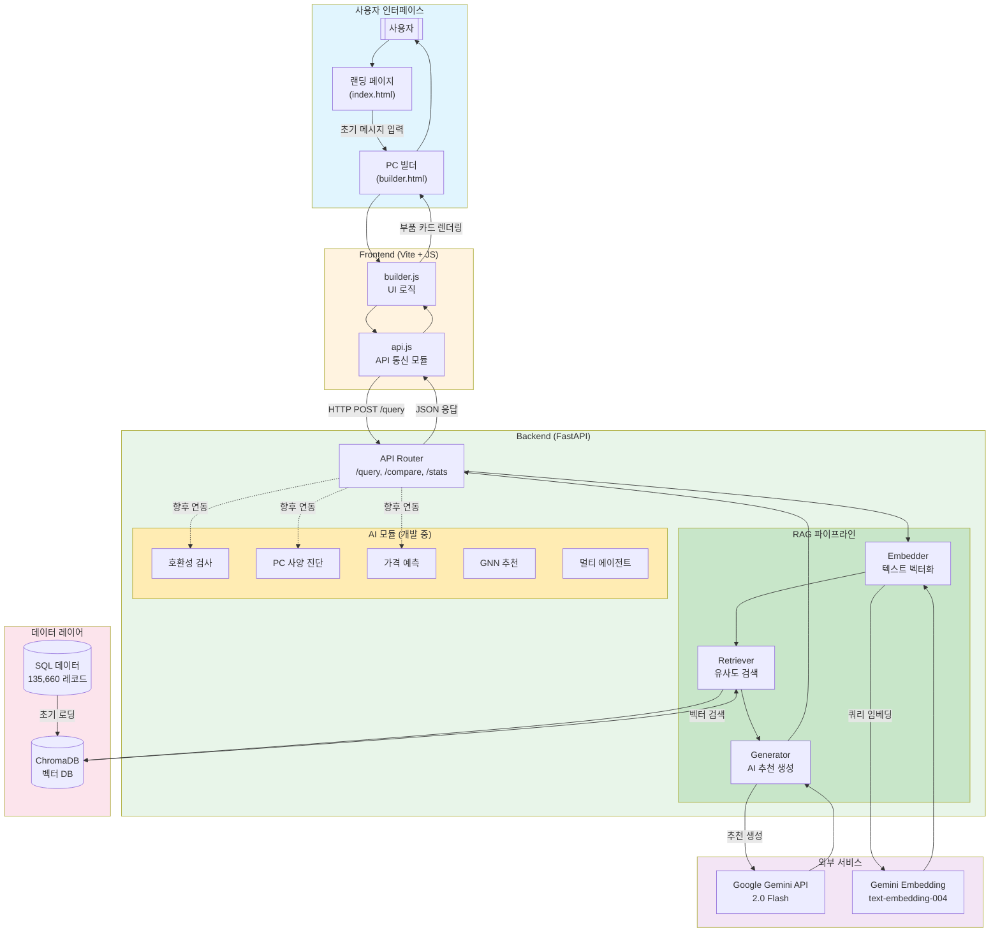
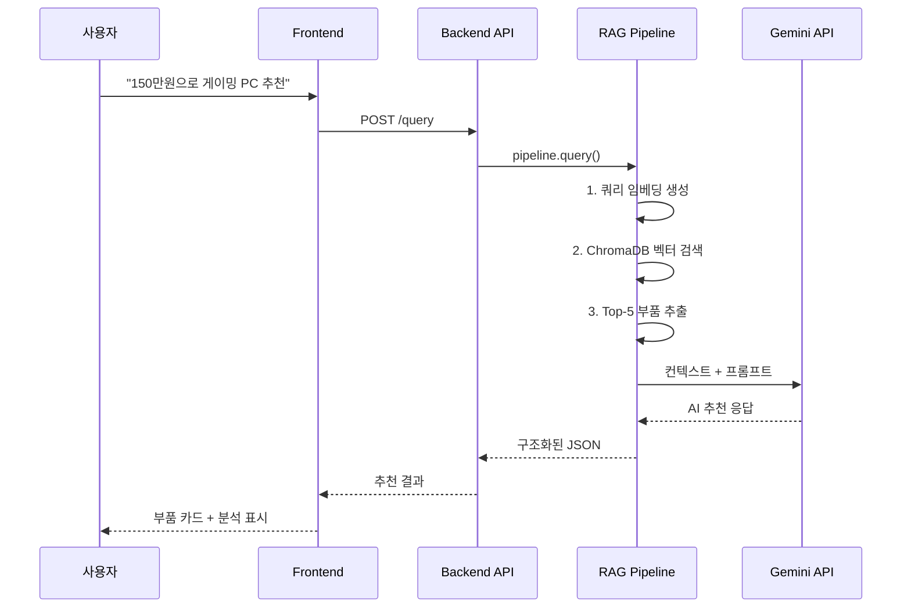
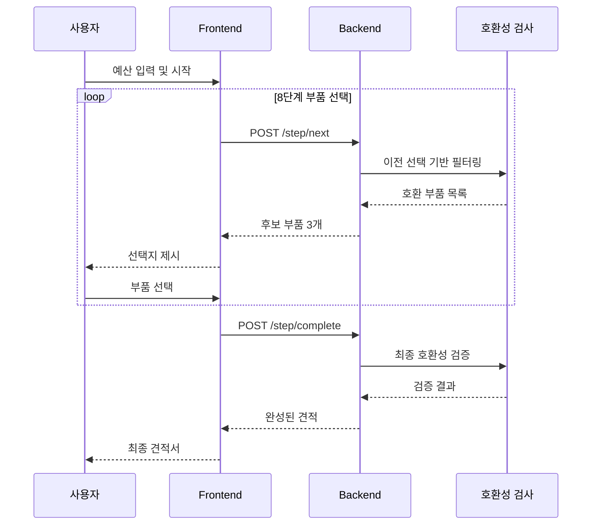

# Spckit AI - PC 부품 추천 시스템

> AI 기반 맞춤형 PC 부품 추천 및 견적 서비스


---

## 목차

- [서비스 개요](#서비스-개요)
- [서비스 플로우](#서비스-플로우)
- [시스템 아키텍처](#시스템-아키텍처)
- [주요 기능](#주요-기능)
- [기술 스택](#기술-스택)
- [프로젝트 구조](#프로젝트-구조)
- [시작하기](#시작하기)
- [Docker 배포](#docker-배포)
- [API 문서](#api-문서)
- [모듈 상세](#모듈-상세)
- [개발 현황](#개발-현황)
- [문서 가이드](#문서-가이드)

---

## 서비스 개요

**Spckit AI**는 Google Gemini 2.0 Flash와 RAG(Retrieval-Augmented Generation) 기술을 활용하여 사용자의 요구사항, 예산, 사용 목적에 따라 최적의 PC 부품 조합을 추천하는 지능형 시스템이다.

### 핵심 가치

| 항목 | 설명 |
|------|------|
| **맞춤형 추천** | 사용자의 예산과 목적에 맞는 정확한 부품 추천 |
| **실시간 검색** | 135,000+ 부품 데이터베이스에서 벡터 기반 의미 검색 |
| **AI 기반 분석** | Gemini를 활용한 상세한 견적 분석 및 호환성 검증 |
| **빠른 응답** | ChromaDB 벡터 저장소를 통한 밀리초 단위 검색 |

### 핵심 지표

| 항목 | 수치 |
|------|------|
| 총 부품 데이터 | 135,660개 |
| 벡터 문서 | 3,000개 |
| 지원 부품 카테고리 | 10개 (CPU, GPU, RAM, SSD 등) |
| 평균 검색 시간 | < 1초 |
| AI 응답 생성 시간 | 3-6초 |
| 검색 정확도 (유사도) | 50-62% |

---

## 서비스 플로우

### 전체 서비스 흐름도



### 사용자 시나리오별 흐름

#### 시나리오 1: 기본 PC 추천



#### 시나리오 2: 단계별 PC 조립 (개발 예정)



---

## 시스템 아키텍처

### 전체 아키텍처

```
┌─────────────────────────────────────────────────────────────────────────────┐
│                              사용자 (브라우저)                               │
└─────────────────────────────────────────────────────────────────────────────┘
                                     │
                                     ▼
┌─────────────────────────────────────────────────────────────────────────────┐
│                         프론트엔드 (Vite + JS)                               │
│  ┌─────────────┐  ┌─────────────┐  ┌─────────────┐  ┌─────────────────┐    │
│  │ index.html  │  │ builder.html│  │   api.js    │  │   builder.js    │    │
│  │ (랜딩)      │  │ (PC 빌더)   │  │ (API 통신)  │  │  (UI 로직)      │    │
│  └─────────────┘  └─────────────┘  └──────┬──────┘  └─────────────────┘    │
└────────────────────────────────────────────┼────────────────────────────────┘
                                             │ HTTP/JSON
                                             ▼
┌─────────────────────────────────────────────────────────────────────────────┐
│                          백엔드 API (FastAPI)                                │
│                                                                              │
│  ┌──────────────────────────────────────────────────────────────────────┐  │
│  │                         api/main.py (라우터)                          │  │
│  │  POST /query          - 기본 추천 [완성]                             │  │
│  │  POST /query-by-specs - 사양 기반 추천 [완성]                        │  │
│  │  POST /compare        - 부품 비교 [완성]                             │  │
│  │  GET  /stats          - 시스템 통계 [완성]                           │  │
│  │  GET  /health         - 헬스 체크 [완성]                             │  │
│  │  ────────────────────────────────────────────────────                │  │
│  │  POST /diagnose       - 내 사양 진단 [개발 예정]                     │  │
│  │  POST /predict-price  - 가격 예측 [개발 예정]                        │  │
│  │  POST /compatibility  - 호환성 검사 [개발 예정]                      │  │
│  └──────────────────────────────────────────────────────────────────────┘  │
│                                     │                                        │
│                                     ▼                                        │
│  ┌──────────────────────────────────────────────────────────────────────┐  │
│  │                        모듈 레이어                                    │  │
│  │  ┌────────────┐ ┌────────────┐ ┌────────────┐ ┌────────────────────┐ │  │
│  │  │    RAG     │ │ 멀티에이전트│ │  PC 진단   │ │    가격 예측       │ │  │
│  │  │  [완성]    │ │  [뼈대]    │ │  [뼈대]    │ │     [뼈대]         │ │  │
│  │  └────────────┘ └────────────┘ └────────────┘ └────────────────────┘ │  │
│  │  ┌────────────┐ ┌────────────┐                                       │  │
│  │  │ GNN 추천   │ │ 호환성검사 │                                       │  │
│  │  │  [뼈대]    │ │  [뼈대]    │                                       │  │
│  │  └────────────┘ └────────────┘                                       │  │
│  └──────────────────────────────────────────────────────────────────────┘  │
│                                     │                                        │
│                                     ▼                                        │
│  ┌──────────────────────────────────────────────────────────────────────┐  │
│  │                       데이터 레이어                                   │  │
│  │  ┌────────────────┐  ┌────────────────┐  ┌────────────────────────┐ │  │
│  │  │ ChromaDB       │  │  SQL 데이터     │  │  가격 이력 DB          │ │  │
│  │  │ (벡터 검색)    │  │  (부품 정보)   │  │  [구축 예정]           │ │  │
│  │  │ [완성]         │  │  [완성]        │  │                        │ │  │
│  │  └────────────────┘  └────────────────┘  └────────────────────────┘ │  │
│  └──────────────────────────────────────────────────────────────────────┘  │
└─────────────────────────────────────────────────────────────────────────────┘
```

### RAG 파이프라인 상세

```
[사용자 쿼리: "150만원 게이밍 PC"]
                │
                ▼
┌───────────────────────────────────┐
│ 1. 임베딩 생성                    │
│    Gemini text-embedding-004      │
│    → 768차원 벡터                 │
└───────────────┬───────────────────┘
                ▼
┌───────────────────────────────────┐
│ 2. 벡터 검색                      │
│    ChromaDB에서 Top-K 검색        │
│    (K=5, 유사도 ≥ 50%)           │
└───────────────┬───────────────────┘
                ▼
┌───────────────────────────────────┐
│ 3. 컨텍스트 구성                  │
│    검색된 부품 정보 조합          │
│    메타데이터 포함                │
└───────────────┬───────────────────┘
                ▼
┌───────────────────────────────────┐
│ 4. AI 추천 생성                   │
│    Gemini 2.0 Flash               │
│    구조화된 JSON 응답             │
└───────────────┬───────────────────┘
                ▼
[응답: {analysis, components, total_price}]
```

---

## 주요 기능

### 1. RAG 기반 PC 부품 추천 (완성)

자연어 쿼리를 통해 사용자의 요구사항에 맞는 PC 부품을 추천한다.

```python
# 예시 쿼리
"150만원 예산으로 게이밍 PC 견적 짜줘"
"인텔 i7 프로세서 추천해줘"
"영상 편집용 고성능 워크스테이션"
```

**응답 예시:**
```json
{
  "analysis": "게이밍 용도로 150만원 예산에서 최적의 구성을...",
  "components": [
    {
      "category": "cpu",
      "name": "Intel Core i5-14600K",
      "price": "380000",
      "features": ["14코어", "최대 5.3GHz", "게이밍 최적화"]
    }
  ],
  "total_price": "1,450,000",
  "additional_notes": "파워 서플라이 650W 이상 권장"
}
```

### 2. 사양 기반 검색 (완성)

예산, 목적, 선호 카테고리를 기반으로 맞춤형 부품 세트를 추천한다.

### 3. 부품 비교 분석 (완성)

여러 부품의 장단점을 비교 분석하여 최적의 선택을 도와준다.

### 4. 개발 예정 기능

| 기능 | 모듈 | 상태 | 설명 |
|------|------|------|------|
| 호환성 검사 | `compatibility` | 뼈대 | CPU-메인보드 소켓, 메모리 타입 등 |
| PC 사양 진단 | `pc_diagnosis` | 뼈대 | 현재 PC 성능 분석, 업그레이드 추천 |
| 가격 예측 | `price_prediction` | 뼈대 | 시계열 분석 기반 가격 추세 예측 |
| GNN 추천 | `recommendation` | 뼈대 | 그래프 신경망 기반 개인화 추천 |
| 멀티 에이전트 | `multi_agent` | 뼈대 | CREWai 기반 복합 추천 시스템 |

---

## 기술 스택

### Frontend

| 항목 | 기술 |
|------|------|
| Framework | Vanilla JavaScript + Vite 6.2.0 |
| Styling | Custom CSS |
| API Client | Fetch API |

### Backend

| 항목 | 기술 |
|------|------|
| Language | Python 3.10+ |
| API Framework | FastAPI 0.110.0+ |
| AI/ML | Google Gemini 2.0 Flash |
| Embedding | Gemini text-embedding-004 |
| Vector DB | ChromaDB 0.5.0+ |
| Package Manager | uv |

### 데이터

| 항목 | 내용 |
|------|------|
| Vector Store | ChromaDB (로컬 영구 저장) |
| Source Data | MySQL Dump (135,660 레코드) |
| 지원 카테고리 | CPU, GPU, RAM, SSD, HDD, 메인보드, 파워, 케이스, 쿨러, 모니터 |

---

## 프로젝트 구조

```
SpckitAI/
├── frontend/                  # 프론트엔드 애플리케이션
│   ├── index.html            # 랜딩 페이지
│   ├── builder.html          # PC 빌더 (4분할 레이아웃)
│   ├── landing.css           # 랜딩 스타일
│   ├── builder.css           # 빌더 스타일
│   ├── js/
│   │   ├── api.js            # 백엔드 API 통신
│   │   ├── builder.js        # 빌더 UI 로직
│   │   ├── landing.js        # 랜딩 페이지 로직
│   │   └── prompts.js        # 프롬프트 관리
│   └── images/               # 이미지 에셋
│
├── backend/                   # 백엔드 시스템
│   ├── api/                  # FastAPI REST API
│   │   └── main.py           # API 엔드포인트 라우터
│   │
│   ├── rag/                  # RAG 핵심 모듈 [완성]
│   │   ├── config.py         # 설정 관리
│   │   ├── embedder.py       # Gemini 임베딩 생성
│   │   ├── vector_store.py   # ChromaDB 관리
│   │   ├── retriever.py      # 문서 검색
│   │   ├── generator.py      # AI 응답 생성
│   │   ├── data_parser.py    # SQL 파싱
│   │   ├── pipeline.py       # RAG 파이프라인
│   │   └── step_by_step.py   # 단계별 선택 [뼈대]
│   │
│   ├── modules/              # AI 모듈 [개발 중]
│   │   ├── multi_agent/      # CREWai 멀티 에이전트
│   │   ├── pc_diagnosis/     # PC 사양 진단
│   │   ├── price_prediction/ # 가격 예측
│   │   ├── recommendation/   # GNN 추천 시스템
│   │   ├── compatibility/    # 호환성 검사 엔진
│   │   └── SERVICE_ARCHITECTURE.md
│   │
│   ├── tests/                # 테스트 파일
│   ├── scripts/              # 유틸리티 스크립트
│   │   ├── init_database.py  # 벡터 DB 초기화
│   │   └── test_rag.py       # RAG 테스트
│   │
│   ├── data/                 # 데이터 파일
│   │   └── pc_data_dump.sql  # PC 부품 DB (11MB)
│   │
│   ├── chroma_db/            # ChromaDB 저장소 (자동 생성)
│   ├── pyproject.toml        # Python 프로젝트 설정
│   ├── requirements.txt      # pip 의존성
│   ├── ONBOARDING.md         # 온보딩 가이드
│   └── README.md             # 백엔드 가이드
│
├── docs/                      # 문서
│   ├── INDEX.md              # 문서 목차
│   ├── QUICK_START.md        # 빠른 시작 가이드
│   ├── RAG_GUIDE.md          # RAG 시스템 가이드
│   ├── DEPLOYMENT_GUIDE.md   # 배포 가이드
│   ├── TROUBLESHOOTING.md    # 문제 해결
│   └── CHANGELOG.md          # 변경 이력
│
├── Dockerfile                 # Docker 설정
├── .env.example              # 환경 변수 예시
├── package.json              # Node.js 의존성
├── vite.config.ts            # Vite 설정
├── run_dev.bat               # Windows 개발 서버 실행
├── run_dev.sh                # Linux/Mac 개발 서버 실행
├── setup_dev.bat             # Windows 개발 환경 설정
└── setup_dev.sh              # Linux/Mac 개발 환경 설정
```

---

## 시작하기

### 빠른 시작 (자동 설정)

```bash
# 1. 저장소 클론
git clone <repository-url>
cd SpckitAI

# 2. 자동 설정 실행
# Windows
setup_dev.bat

# Linux/Mac
chmod +x setup_dev.sh
./setup_dev.sh
```

자동 설정 스크립트가 수행하는 작업:
- uv 설치 확인 및 설치
- 가상 환경 생성
- 의존성 설치
- .env 파일 생성 (API 키 입력)
- 벡터 DB 초기화 (선택)

### 개발 서버 실행

```bash
# 프론트엔드 + 백엔드 통합 실행
# Windows
run_dev.bat

# Linux/Mac
./run_dev.sh
```

서버가 시작되면:
- Frontend: http://localhost:3000
- Backend API: http://localhost:8000
- API 문서: http://localhost:8000/docs
- 헬스 체크: http://localhost:8000/health

### 수동 설정

#### 1. Backend 설정

```bash
cd backend

# 가상 환경 생성
uv venv

# 활성화 (Windows)
.venv\Scripts\activate

# 활성화 (Linux/Mac)
source .venv/bin/activate

# 의존성 설치
uv pip install -e .
```

#### 2. 환경 변수 설정

```bash
# .env 파일 생성
cp .env.example .env

# API 키 설정 (편집기로 열어서 수정)
# GEMINI_API_KEY=your_actual_api_key
```

API 키 발급: https://aistudio.google.com/

#### 3. 벡터 DB 초기화

```bash
# 처음 실행 시 (약 10-15분 소요)
python backend/scripts/init_database.py

# 강제 재초기화
python backend/scripts/init_database.py --force
```

#### 4. 서버 실행

```bash
# Backend API
cd backend
uvicorn api.main:app --reload --port 8000

# Frontend (새 터미널)
npm install
npm run dev
```

---

## Docker 배포

### 빠른 Docker 실행

```bash
# 1. 이미지 빌드
docker build -t spckit-ai .

# 2. 컨테이너 실행
docker run -d \
  -p 8000:8000 \
  -e GEMINI_API_KEY=your_api_key \
  --name spckit-ai \
  spckit-ai
```

### Docker Compose (권장)

```yaml
# docker-compose.yml
version: '3.8'

services:
  spckit-ai:
    build: .
    ports:
      - "8000:8000"
    environment:
      - GEMINI_API_KEY=${GEMINI_API_KEY}
      - ENVIRONMENT=production
      - AUTO_INIT_DB=true
    volumes:
      - chroma_data:/app/backend/chroma_db
    restart: unless-stopped

volumes:
  chroma_data:
```

실행:
```bash
# .env 파일에 GEMINI_API_KEY 설정 후
docker-compose up -d
```

### Dockerfile 구조

```dockerfile
# 1. Frontend 빌드 단계
FROM node:20-alpine AS frontend-builder
# 프론트엔드 빌드

# 2. Runtime 단계
FROM python:3.11-slim
# 백엔드 + 빌드된 프론트엔드 서빙
```

### 프로덕션 배포 옵션

| 플랫폼 | 용도 | 장점 |
|--------|------|------|
| **Vercel** | Frontend | 무료, 자동 CDN, GitHub 연동 |
| **GCP Cloud Run** | Backend | 서버리스, 자동 스케일링 |
| **Docker + VM** | 통합 | 완전한 제어, 비용 효율 |

자세한 배포 가이드: [docs/DEPLOYMENT_GUIDE.md](docs/DEPLOYMENT_GUIDE.md)

---

## API 문서

### 엔드포인트 요약

| Method | Endpoint | 설명 | 상태 |
|--------|----------|------|------|
| `GET` | `/` | 서비스 정보 | 완성 |
| `GET` | `/health` | 헬스 체크 | 완성 |
| `GET` | `/stats` | DB 통계 | 완성 |
| `POST` | `/query` | 기본 추천 | 완성 |
| `POST` | `/query-by-specs` | 사양 기반 추천 | 완성 |
| `POST` | `/compare` | 부품 비교 | 완성 |

### 요청/응답 예시

#### POST /query

```bash
curl -X POST "http://localhost:8000/query" \
  -H "Content-Type: application/json" \
  -d '{
    "query": "게임용 CPU 추천",
    "top_k": 5
  }'
```

**응답:**
```json
{
  "query": "게임용 CPU 추천",
  "recommendation": {
    "analysis": "게임용 CPU로는 높은 싱글코어 성능이 중요합니다...",
    "components": [
      {
        "category": "cpu",
        "name": "Intel Core i5-14600K",
        "price": "380000",
        "features": ["14코어", "5.3GHz 부스트"]
      }
    ],
    "total_price": "380000"
  },
  "retrieved_count": 5
}
```

#### POST /query-by-specs

```bash
curl -X POST "http://localhost:8000/query-by-specs" \
  -H "Content-Type: application/json" \
  -d '{
    "budget": 150,
    "purpose": "게임",
    "categories": ["cpu", "gpu", "memory"],
    "top_k": 3
  }'
```

전체 API 문서: http://localhost:8000/docs

---

## 모듈 상세

### RAG 모듈 (`backend/rag/`) - 완성

| 파일 | 역할 |
|------|------|
| `embedder.py` | Gemini Embedding API를 사용한 텍스트 벡터화 |
| `vector_store.py` | ChromaDB 관리 및 벡터 저장/검색 |
| `retriever.py` | 의미 기반 부품 검색, Top-K 랭킹 |
| `generator.py` | Gemini 2.0 Flash 기반 추천 응답 생성 |
| `data_parser.py` | MySQL 덤프 파일 파싱 |
| `pipeline.py` | 전체 RAG 워크플로우 통합 |

### AI 모듈 (`backend/modules/`) - 개발 중

| 모듈 | 상태 | 목표 |
|------|------|------|
| `compatibility/` | 뼈대 | 부품 간 호환성 검증 (소켓, 폼팩터, 전력) |
| `pc_diagnosis/` | 뼈대 | 현재 PC 성능 진단 및 업그레이드 추천 |
| `price_prediction/` | 뼈대 | Prophet/TFT 기반 가격 예측 |
| `recommendation/` | 뼈대 | GNN 기반 개인화 추천 |
| `multi_agent/` | 뼈대 | CREWai 멀티 에이전트 오케스트레이션 |

자세한 모듈 개발 가이드: [backend/modules/README.md](backend/modules/README.md)

---

## 개발 현황

### 완료된 기능

- [x] RAG 시스템 구현 (파이프라인, 임베딩, 검색, 생성)
- [x] ChromaDB 벡터 DB 구축 (3,000 문서)
- [x] FastAPI REST API (query, compare, stats)
- [x] Frontend UI (랜딩, PC 빌더)
- [x] Docker 배포 구성
- [x] 자동 개발 환경 설정 스크립트

### 개발 중

- [ ] AI 모듈 실제 로직 구현
  - [ ] 호환성 검사 엔진
  - [ ] PC 사양 진단
  - [ ] 가격 예측 모델
  - [ ] GNN 추천 시스템
- [ ] Step-by-Step PC 빌더
- [ ] 3D 부품 시각화

### 계획 중

- [ ] 사용자 인증 시스템
- [ ] 견적 저장/공유
- [ ] 실시간 가격 연동
- [ ] 모바일 앱

---

## 문서 가이드

| 문서 | 내용 |
|------|------|
| [docs/QUICK_START.md](docs/QUICK_START.md) | 빠른 시작 가이드 |
| [docs/RAG_GUIDE.md](docs/RAG_GUIDE.md) | RAG 시스템 상세 가이드 |
| [docs/DEPLOYMENT_GUIDE.md](docs/DEPLOYMENT_GUIDE.md) | 프로덕션 배포 가이드 |
| [docs/TROUBLESHOOTING.md](docs/TROUBLESHOOTING.md) | 문제 해결 |
| [docs/CHANGELOG.md](docs/CHANGELOG.md) | 변경 이력 |
| [backend/README.md](backend/README.md) | 백엔드 상세 가이드 |
| [backend/modules/README.md](backend/modules/README.md) | AI 모듈 개발 가이드 |
| [backend/modules/SERVICE_ARCHITECTURE.md](backend/modules/SERVICE_ARCHITECTURE.md) | 서비스 아키텍처 문서 |

---

## 기여하기

1. Fork the Project
2. Create your Feature Branch (`git checkout -b feature/모듈명/기능/날짜`)
3. Commit your Changes (`git commit -m 'Add: 기능 설명'`)
4. Push to the Branch (`git push origin feature/모듈명/기능/날짜`)
5. Open a Pull Request

브랜치 명명 규칙:
- `feature/` - 새 기능 추가
- `fix/` - 버그 수정
- `docs/` - 문서 작업

---

## 라이선스

이 프로젝트는 MIT 라이선스 하에 배포된다.

---

## 감사의 말

- Google Generative AI (Gemini 2.0 Flash)
- ChromaDB Team
- FastAPI Team
- PC 부품 데이터 제공자

---

**Made with Python, FastAPI, and Google Gemini**
